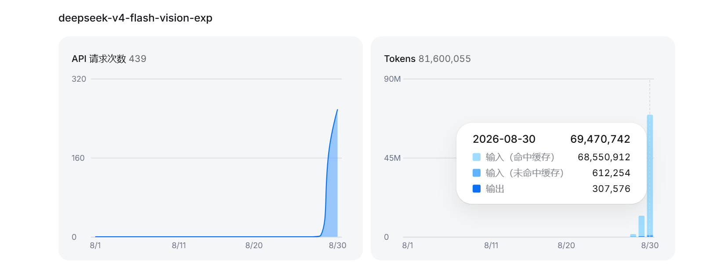
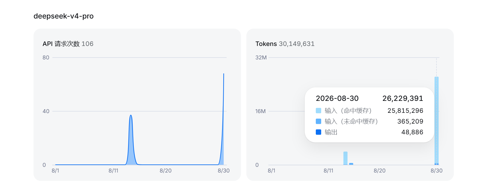

# 聊天框MJ(MJMJNIKUAIHUILAIBA)

一个《我的世界》NeoForge模组。面向26.2版本。不考虑后续更新，除非Star突破3个。

当玩家在聊天框中输入 **MJ** 时，会像抖音聊天框一样出现蜘蛛人并播放MP4动画，占用玩家时间和内存空间。

采用 **DeepSeek-V4-Flash-Vision-Exp** 和 **DeepSeek-V4-Pro** 制作，思考等级均为MAX。

该项目前期由Agent： **Deepseek HARNESS** 构建主体。后期由 **CodeX（换脑DS V4Flash）** 修复BUG、上传项目至GitHub

开发此项目时，在DSH上面耗费了极大的金额（11.90CNY）。

（其实本来不想用CodeX的，后面DSH不好使才用CodeX修BUG。只不过我懒得去看和改这个屎山Readme了，我将用最一针见血最直白最明了最清晰的语音告诉你：CodeX又花了4块钱左右，总计约15块钱）

其中金额花费如下：

**DeepSeek-V4-Flash-Vision-Exp** ：￥6.17

**DeepSeek-V4-Pro** ：￥5.73

Token（词元）消耗如下（非高峰期）：





其中V4-Flash构建主题，V4-Pro修正BUG。Pro只用了一次对话就吃了这么多钱。不可避免地使该项目的资金超出预算的100%。

## 效果展示

抖音搜MJ第一个视频就是。

## 其他

以下内容由AI所撰。

我太久搞这些东西没我也不知道AI写得啥玩意。前两个项目好歹看得懂代码还会改点BUG，而且项目也是自己部署的，连Github也是自己上传的。现在跟傻福没区别了。Agent真是太方便了你知道吗。

## 聊天视频触发 (Chat Video Trigger · NeoForge)

一个 **纯客户端** 的 NeoForge 模组，面向 Minecraft `1.26.2` / NeoForge `26.2.0.72`。
当玩家在聊天框里输入一段 **自定义触发文字** 时，会在玩家屏幕上 **全屏播放一段自定义视频**。
如果一个触发词配置了多段视频，则每次 **随机播放其一**。

## 功能特性

- **自定义触发文字** — 编辑 `config/videotrigger/triggers.json`。
- **默认大小写不敏感** — `case_sensitive: false` 时 `MJ`、`mj`、`Mj` 都能触发。
- **自定义视频** — 在 `config/videotrigger/videos/` 放入你的 GIF、MP4 或一个 PNG/JPG 帧文件夹。
- **随机播放** — 一个触发词可配置多个视频，每次触发按等概率随机选一个。
- **热重载** — 配置文件改动后会自动重新读取（无需重进游戏）。
- **游戏内命令** — 用 `/videotrigger` 实时管理触发词。
- **内置示例** — 首次运行自动生成一段示例动画，让示例触发词 `MJ` 开箱即用。

## 配置

配置文件位于 `config/videotrigger/triggers.json`：

```json
{
  "consume_trigger_message": false,
  "pause_game": true,
  "scale": 1.0,
  "case_sensitive": false,
  "default_fps": 20.0,
  "triggers": [
    {
      "trigger": "MJ",
      "videos": [
        { "type": "gif",    "path": "videos/anim1.gif",  "loop": true },
        { "type": "mp4",    "path": "videos/anim2.mp4",  "loop": true },
        { "type": "frames", "path": "videos/anim3",      "fps": 30, "loop": true }
      ]
    }
  ]
}
```

| 配置项 | 说明 |
|--------|------|
| `consume_trigger_message` | `true` = 触发词不在聊天框广播；默认 `false`（触发词照常发出，视频照常播放）。 |
| `pause_game` | `true` = 播放视频时暂停游戏（单人）。 |
| `scale` | 屏幕上的尺寸倍率（0.05–1.0）。 |
| `case_sensitive` | `false` = `MJ`/`mj`/`Mj` 都会触发匹配。 |
| `default_fps` | 视频片段未单独指定 FPS 时使用的默认帧率。 |
| `trigger` | 在聊天框输入以触发视频的确切文字。 |
| `videos[]` | 候选视频；每次触发随机选一个。 |
| `videos[].type` | `"gif"`（动图）、`"mp4"`（MP4/H.264）、`"frames"`（图片帧文件夹）。 |
| `videos[].path` | 相对 `config/videotrigger/` 的路径。 |
| `videos[].fps` | 单个视频的帧率覆盖（可选）。 |
| `videos[].loop` | 单个视频是否循环（默认 `false` = 只播一遍后自动停止）。 |

### 视频格式

- **`frames`** — 把一个目录下的编号图片作为帧，例如
  `config/videotrigger/videos/myclip/frame_0000.png`、`frame_0001.png`、……
  建议文件名用 4 位以上补零（便于按数字排序）。支持 `.png`、`.jpg`、`.jpeg`、`.bmp`。
- **`gif`** — 单个动图文件，例如 `config/videotrigger/videos/anim.gif`。
- **`mp4`** — 单个 MP4/H.264 文件（用 JCodec 解码），例如 `config/videotrigger/videos/anim.mp4`。

> 提示：内置的 JCodec 不支持 WebM(VP9)；如需用它，请先转成 MP4 / GIF / PNG 帧。

## 游戏内命令

客户端专属命令 `/videotrigger`：

| 命令 | 作用 |
|------|------|
| `/videotrigger reload` | 从磁盘重新读取 `triggers.json`。 |
| `/videotrigger list` | 列出所有触发词及其视频数量。 |
| `/videotrigger test <trigger>` | 立即随机播放某触发词的一个视频。 |
| `/videotrigger add <trigger> <type> <path>` | 向某触发词添加一个视频片段并保存（`type` 为 `frames`/`gif`/`mp4`）。 |

## 工作原理

1. `ClientChatHandler` 监听玩家提交的聊天文字。
2. 将输入与每个配置的 `trigger` 做大小写不敏感匹配。
3. 命中后随机取一个 `videos[]`，在后台线程解码。
4. `VideoScreen` 把解码出的帧作为全屏遮罩实际渲染，每帧更新 GPU 纹理。

## 构建

需要 **JDK 25** 和完整网络（Gradle 会下载 NeoForge 工具链、Minecraft 客户端以及
Mojang 的 `com.mojang:*` 库）。

正常联网环境下：

```powershell
$env:JAVA_HOME = "C:\path\to\jdk-25"
.\gradlew build
```

产物在 `build/libs/`，把它放进 NeoForge 26.2 客户端的 `mods/` 文件夹即可运行。

### 在 IDEA 中构建

`gradle.properties` 默认不写死任何本机路径（克隆后即可构建），只保留 JDK 25 / 版本号等
通用配置。打开项目后直接 **Sync（同步 Gradle）** 即可，Gradle 会自动检测或下载 JDK 25。

- 如果 IDEA 的 Gradle JVM 不是 JDK 25，请在 **Settings → Build Tools → Gradle → Gradle JVM**
  里选一个本地 JDK 25，然后重新同步。
- 本工作区若走 `.toolchain` 离线/代理方案，可在 `gradle.properties` 里取消注释
  `org.gradle.java.home` 与 `org.gradle.java.installations.paths`（按你实际路径改）。

### 运行游戏（开发环境）

```powershell
.\build.ps1 runClient
```

客户端窗口会在本机桌面打开（本机 GPU 与音频正常）。进入单人游戏后按 `T` 输入 `MJ`，
即可看到随机择一播放的示例动画；配置改在 `config/videotrigger/triggers.json`（热重载）。


### 镜像 / 离线构建说明

如果机子访问不了 Mojang 官方源 `libraries.minecraft.net` / `resources.download.minecraft.net`
（例如本机网络受限），本项目已在 `build.gradle` 里加入 **BMCLAPI 镜像**：

```gradle
repositories {
    maven {
        url = 'https://bmclapi2.bangbang93.com/maven/'
        content { includeGroup 'com.mojang'; includeGroup 'net.minecraft' }
    }
}
```

它镜像了 Mojang 的 `com.mojang:*` / `net.minecraft:*` 库，能让 Gradle 正确解析编译依赖。
本仓库目录下用自带工具链 `.\build.ps1 build` 即可构建（无需另装 Gradle/JDK）。
若首次构建因 NFRT 需要下载游戏资源而卡在 `createMinecraftArtifacts`，请确保能访问
`piston-data.mojang.com`（客户端 jar）与镜像站；这些在受限网络下可能需要额外配置。
